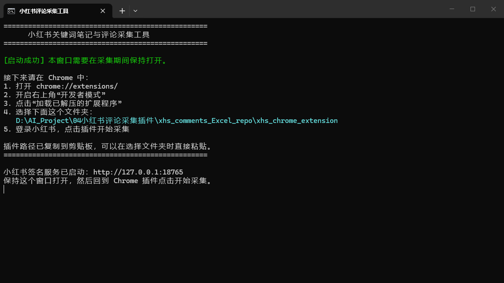
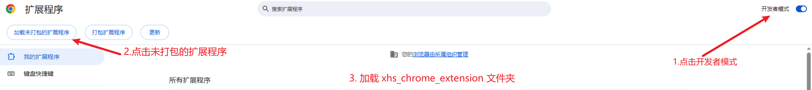
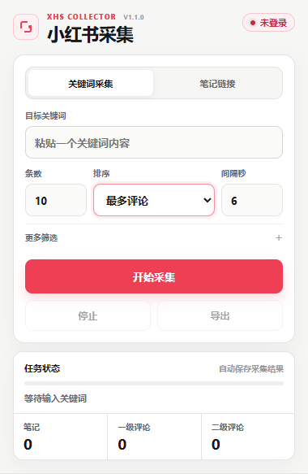

# 小红书评论采集使用说明 v1.1

> 💡 **用途：**按关键词或单篇笔记链接，采集公开笔记、一级评论和二级评论，并导出 Excel。

## 仓库内容

- [`xhs_comments_Excel_repo.rar`](xhs_comments_Excel_repo.rar)：小红书评论采集插件完整压缩包，下载后解压使用。
- [`xhs_comments_Excel_py`](xhs_comments_Excel_py)：独立的 Python 好评、差评分析项目，保持原样，使用方法见文件夹内说明。

两个项目功能不同，互不影响，按需要选择即可。

## 附件

仓库内已附完整压缩包，可直接下载使用：

**[下载 xhs_comments_Excel_repo.rar](xhs_comments_Excel_repo.rar)**

## 第一次使用

1. 下载并解压附件，双击 **启动采集工具.bat**。
2. 保持黑色窗口打开，按下面两张图加载插件；然后**登录**小红书。

## 开始采集

### 关键词采集

1. 选择“关键词采集”，粘贴一个关键词。
2. 设置采集条数和排序；需要时展开“更多筛选”。
3. 点击“开始采集”，等待 Excel 自动下载。

### 笔记链接采集

1. 选择“笔记链接”。
2. 粘贴一条小红书笔记链接或分享文字。
3. 点击“开始采集”，等待 Excel 自动下载。

> ✅ **首次测试：**建议先采集 1～3 条笔记，确认能正常导出后再正式使用。

### 停止采集

- **采完当前笔记：**采完整篇评论后停止并保存 Excel，推荐使用。
- **立即停止：**马上中断；已采数据会保留，但当前笔记的评论可能不完整。

## 导出数据

| 文件 | 用途 |
| --- | --- |
| `notes_raw.xlsx` | 看采集到了哪些笔记 |
| `comments_raw.xlsx` | 看笔记下面的评论内容 |

> 💡 **导出说明：**完成或停止后会自动下载两份 Excel。文件默认保存在 Chrome 的“下载”文件夹。

## 常见问题

- **自动安装失败：**检查网络后重新双击启动文件；仍失败时，按黑色窗口提示安装 Node.js LTS。
- **点击开始没有反应：**确认黑色窗口仍在运行，并确认当前 Chrome 已登录小红书。
- **插件界面没有更新：**打开 **chrome://extensions/**，点击插件上的“重新加载”。
- **出现验证码或安全限制：**停止采集，稍后再试；关键词采集可适当调大间隔秒数。

> 📮 需要修改或遇到无法解决的问题，请联系豆角。
