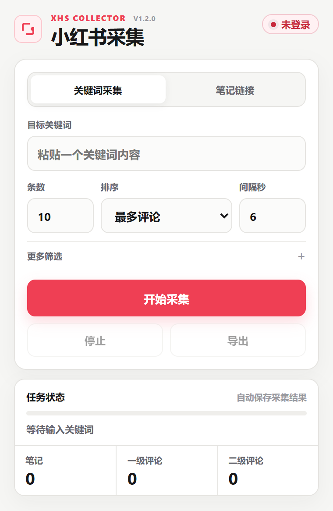

  

<h1 align="center">小红书采集插件</h1>

按关键词或笔记链接采集笔记与评论，导出 Excel。

  <strong>v1.2.2</strong> · Windows 64 位 · Chrome · 便携版

  <a href="https://github.com/flyyang12-rgb/xhs_comments_Excel/raw/refs/heads/main/xhs_comments_Excel_repo.rar"><strong>下载插件 RAR · 34.4 MB</strong></a>

  <a href="#安装与首次使用">安装说明</a>
  &nbsp; / &nbsp;
  <a href="#常见问题">常见问题</a>

解压后即可配置使用，无需另外安装 Python、Node.js 或 Git。

---

## 插件界面

  

两种采集方式共用一个界面，采集过程中可以查看笔记、一级评论和二级评论的数量。

- **关键词采集**：输入关键词，选择笔记数量和排序；需要时按笔记类型、发布时间筛选。
- **笔记链接**：粘贴小红书笔记链接或分享文字，采集指定笔记及评论。

## 安装与首次使用

1. **下载并完整解压**上方的 RAR，放到固定文件夹。
2. **启动本机服务**：双击 `启动采集工具.bat`，保持窗口打开。
3. **加载插件**：在 Chrome 地址栏输入 `chrome://extensions/`，开启「开发者模式」，点击「加载已解压的扩展程序」，选择包内的 `xhs_chrome_extension` 文件夹。
4. **登录小红书**：在同一个 Chrome 中完成登录，再打开插件。
5. **开始采集**：选择采集方式，填写关键词或链接。建议先采集 1～3 条笔记，确认导出结果后再调整数量。

> 从 1.2.1 升级：覆盖原插件目录，在扩展管理页点击「重新加载」，确认插件版本为 **1.2.2**。本机服务仍为 1.2.1，无需重启。从更早版本升级时，请关闭旧服务并启动包内服务。

1.2.2 恢复按域名及当前账户的小红书页面补读 Cookie，保留 HttpOnly 会话；恢复进度日志与底部滚动。登录检测会区分字段不完整和读取失败，不再统一显示「未登录」。自动化回归测试已通过，真实账号的搜索和评论采集尚未验证。

## 导出与停止

完成或停止后，插件会自动下载两份 Excel，默认保存在 Chrome 的下载文件夹。

| 文件 | 内容 |
| --- | --- |
| `notes_raw.xlsx` | 笔记链接、标题、作者、排序方式等笔记信息。 |
| `comments_raw.xlsx` | 一级评论、对应的二级回复，以及评论中的图片链接。 |

需要提前结束时，点击「停止」后选择：

- **采完当前笔记**：完成当前篇的评论采集后停止。
- **立即停止**：停止后续采集，保留已取得的数据；当前篇的评论可能不完整。

## 常见问题

解压后，哪些文件需要保留？

请保留完整的解压目录。`xhs_chrome_extension` 是插件，`service` 是它需要的本机服务和运行组件；启动文件与两份说明也已随包提供。

服务启动失败，或提示端口被占用

先关闭旧签名服务窗口，再运行包内的启动文件。看到「准备就绪，等待插件请求」即表示启动成功；采集时会显示请求类型和结果。新版插件需要配合包内服务，不能继续使用旧签名服务。

登录过期，或插件仍显示旧界面

插件会在当前浏览器账户内自动补读登录字段。字段不完整不等于网页未登录；如补读后仍缺少 `a1` 或 `web_session`，可点击底部「检查登录态」查看诊断，诊断不显示 Cookie 值。其他浏览器或无痕窗口的登录态不共用。只有服务明确返回登录过期时才需要重新登录。如果界面仍是旧版，请检查加载路径，并在扩展管理页重新加载新版的 `xhs_chrome_extension` 文件夹。

出现验证码或访问限制

停止采集，稍后重试。使用关键词采集时，可以适当调大请求间隔。

## 1.2.1 更新

修正登录态检查：同时检查必需字段，只读取当前窗口对应的 Cookie 存储区，避免空值覆盖有效值。服务窗口增加启动、请求和错误提示，日志不输出 Cookie 内容。

## 使用范围

插件使用当前浏览器的登录态访问公开笔记和评论。本机服务只在内存中保存登录态，不写入账号文件。下载包不包含个人 Cookie 或采集结果。

已验证压缩包完整性、解压后的服务启动、本地签名和插件请求适配。测试账号的旧登录态已过期，真实搜索和评论仍需有效登录态验证。

本机服务基于 [Spider_XHS](https://github.com/cv-cat/Spider_XHS)，它提供小红书的鉴权和请求能力；当前采用提交 [`7077c88`](https://github.com/cv-cat/Spider_XHS/commit/7077c88f82771f547cc1afdadaec4025be2355e6)。上游声明仅供学习交流，禁止商业化使用。
